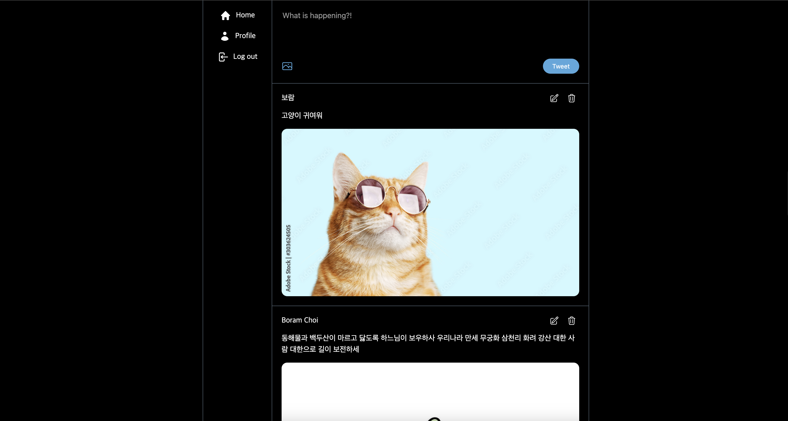
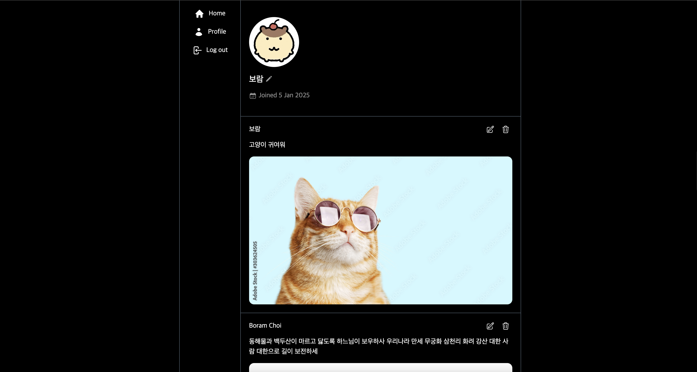

# Nwitter

**🔗 서비스 URL:** https://nwitter-8815a.web.app/

Nwitter는 노마드 코더 - 트위터 클론코딩 강의를 수강하며 진행한 프로젝트로 X(Twitter)를 클론코딩하여 제작하였습니다.

<br/>

## ✨ 주요 기능

- 트윗 게시물 작성: 트윗을 추가, 조회, 수정, 삭제할 수 있습니다.
- 타임라인: 다른 유저들이 작성한 트윗을 실시간으로 볼 수 있습니다.
- 프로필: 프로필을 조회 및 수정할 수 있으며, 내가 작성한 트윗을 볼 수 있습니다.
- 회원가입 및 로그인: Firebase Authentication을 이용하여 이메일, 깃허브로 가입 및 로그인이 가능합니다.

<br/>

## 🛠️ 기술 스택

- Frontend: React, TypeScript
- Backend: Firebase (Firestore, Storage, Hosting, Authentication)

<br/>

## 📌 주요 페이지

1️⃣ Home 페이지 🏠



- 트윗을 작성할 수 있고, 다른 유저들이 작성한 트윗을 확인할 수 있습니다.
  (트윗 작성 시 최대 200자 제한, 이미지 1MB 이내로 한 장 업로드 가능)
- 내가 작성한 트윗은 수정 및 삭제가 가능합니다.

2️⃣ Profile 페이지 👤


- 내 프로필을 조회하고 수정할 수 있습니다.
- 내가 작성한 트윗 목록을 확인하고 수정, 삭제할 수 있습니다.

<br />

## 📂 프로젝트 구조

```
📦 tickets
├── 📂 public
├── 📂 src
│   ├── 📂 components        # 컴포넌트
│   ├── 📂 routes            # 페이지 컴포넌트
│   ├── 📂 hooks             # 커스텀 훅
│   ├── 📂 assets            # 아이콘
│   └── 📜 App.tsx           # 라우트 설정
├── 📂 dist                  # 빌드된 파일
├── 📜 firebase.json         # Firebase 설정
└── 📜 index.html
```
